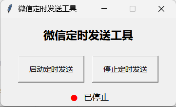

随手用AI写的小软件，支持每周定时循环发送微信消息，但各方面体验还未完善

# 如何使用
使用`python AutoSendWeChat\scheduleApp.py`或者运行`.exe`文件运行  
使用时请保证微信处于登录状态，且打开快捷键为`Ctrl+Alt+W`  
需要创建一个`config.json`文件，指定在星期几的几点发送什么消息到哪个好友/群组  
之后点击`启动定时发送`，看到下方文字变成`运行中`即可  
结束请点击`停止定时发送`

进入群组依赖微信查找，所以对于不常用群组/好友，可能出现查找错误而点开`搜索网页结果`第一条的情况  

## config.json文件编写
文档中给了示例，放在data文件夹下  
最终编写完成的`config.json`文件也需要放在和`scheduleApp.py`或者`.exe`文件同级的`data`文件夹中（如该`git`库中展示的示例结构）  

## config.json字段解释
`comment`：注释，不会被软件读取
`group_name`：想要发送消息的群组/好友名字
`message`：发送的文字消息
`image_path`：发送的图片消息（图片路径）
`weekday`：星期几，例子：“monday”，“Monday”，1，“1”，“周日”，“周天”，“星期日”，“星期天”，“周七”，“星期七”
`time`：具体发送时间，格式“11:23”
`enabled`：true表示启动该条信息的定时发送，false表示禁用该条消息的定时发送